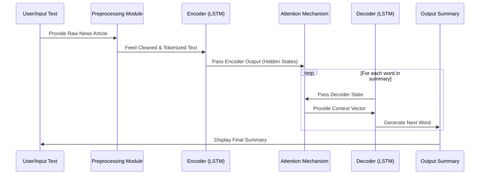

<div align="center">
  <h1>Abstractive Text Summarization of News Articles</h1>
</div>

---

### 📌 Badges
<!-- Add your badges here -->
<p align="center">
  
  
  
</p>
<p align="center">
  
  
  
</p>


### 🔄 Model Workflow
This diagram illustrates the flow of data from input text to the generated summary through the model.



---

### 📖 Overview
This project implements a deep learning model for **abstractive text summarization**. The goal is to generate a concise and coherent summary (like a headline) from a longer news article. Unlike extractive methods that just copy important sentences, this model generates new sentences that capture the essence of the original text. This is achieved using a Sequence-to-Sequence (Seq2Seq) model with an Attention mechanism.

---

### 🧠 Model Architecture: Seq2Seq with Attention

The core of this project is an Encoder-Decoder model built with LSTMs.

-   **Encoder**: A multi-layered LSTM network reads the input news article word-by-word and compresses the information into a context vector (the final hidden state).
-   **Attention Mechanism**: This layer allows the decoder to "look back" at the entire input sequence at each step of the output generation. It calculates attention weights to focus on the most relevant parts of the source text, which is crucial for handling long articles.
-   **Decoder**: Another multi-layered LSTM network takes the encoder's context vector and generates the summary word-by-word. The attention mechanism provides it with a weighted context from the encoder at each time step.

---

### ✨ Features

-   **Text Cleaning**: A robust function to clean and normalize raw text data by handling contractions, special characters, and lowercasing.
-   **Tokenization**: Uses Keras Tokenizer to convert text into sequences of integers.
-   **Padding**: Sequences are padded to a fixed length to be fed into the model.
-   **Deep Learning Model**: An advanced Encoder-Decoder architecture with multiple LSTM layers and a custom Bahdanau Attention layer.
-   **Inference Model**: Separate encoder and decoder models are constructed for efficient prediction on new, unseen articles.
-   **Evaluation**: The model's performance is evaluated using loss/accuracy metrics and by comparing generated summaries against original headlines.

---

### 🛠️ Technologies Used

-   **Python**: Core programming language.
-   **TensorFlow & Keras**: For building and training the deep learning model.
-   **NumPy & Pandas**: For data manipulation and processing.
-   **NLTK & Jiwer**: For text processing and evaluation metrics (like BLEU and WER).
-   **Jupyter Notebook**: For interactive development and experimentation.
-   **WordCloud**: For data visualization.

---

### 🚀 How to Run Locally

1.  **Clone the repository:**
    ```sh
    git clone [https://github.com/your-username/Abstractive-Text-Summarization.git](https://github.com/your-username/Abstractive-Text-Summarization.git)
    cd Abstractive-Text-Summarization
    ```
2.  **Install dependencies:**
    ```sh
    pip install -r requirements.txt
    ```
    *(Ensure you have `tensorflow`, `pandas`, `numpy`, `nltk`, `jiwer` etc. in the file)*
3.  **Run the Jupyter Notebook:**
    ```sh
    jupyter notebook abstractive-text-summarization-of-news-articles.ipynb
    ```
4.  Execute the cells in order to train the model and generate summaries.

---

### 🐍 Code Implementation

Below is a snippet from the notebook showing the model definition.

#### Seq2Seq Model with Attention

```python
K.clear_session()

latent_dim = 300 
embedding_dim = 100 

# Encoder
encoder_inputs = Input(shape=(max_text_len,))
encoder_emb = Embedding(text_vocab_length, embedding_dim, trainable=True)(encoder_inputs)
encoder_lstm1 = LSTM(latent_dim, return_sequences=True, return_state=True, dropout=0.3, recurrent_dropout=0.2)
encoder_output1, state_h1, state_c1 = encoder_lstm1(encoder_emb)
# ... more encoder LSTMs ...
encoder_outputs, state_h, state_c = encoder_lstm(encoder_output2)
encoder_states = [state_h,state_c]

# Decoder
decoder_inputs = Input(shape=(None,))
decoder_emb = Embedding(headline_vocab_length, embedding_dim, trainable=True)(decoder_inputs)
decoder_lstm = LSTM(latent_dim, return_sequences=True, return_state=True, dropout=0.3, recurrent_dropout=0.2)
decoder_outputs, _, _ = decoder_lstm(decoder_emb, initial_state=encoder_states) 

# Attention Layer
attn_layer = AttentionLayer(name='attention_layer') 
attn_outputs, attn_states = attn_layer([encoder_outputs, decoder_outputs]) 

# Concatenate Attention output and Decoder LSTM output
decoder_concat_outputs = Concatenate(axis=-1,name='concat_layer')([decoder_outputs, attn_outputs])

# Dense layer
decoder_dense = TimeDistributed(Dense(headline_vocab_length,activation='softmax'))
decoder_outputs = decoder_dense(decoder_concat_outputs)

model = Model([encoder_inputs, decoder_inputs], decoder_outputs)
model.summary()
```

---

### 📊 Dataset

The model is trained on the **News Summary** dataset, which contains news articles and their corresponding headlines from Inshorts.

-   **Source**: Scraped from various Indian news journals (The Hindu, Indian Times, etc.).
-   **Size**: 4,515 examples used in the original dataset.
-   **Content**: Contains columns for the full article text and the short headline summary.

